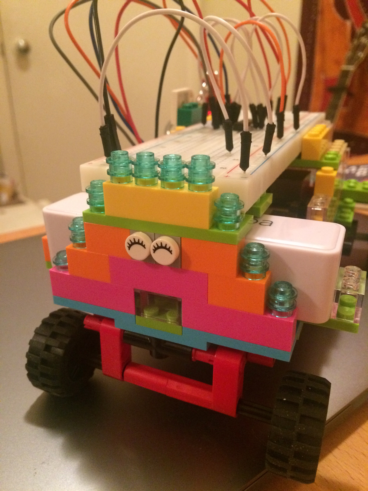

# Flora

I'm trying to make a pet robot.  I called her Flora, after [Florence Nightingale](https://en.wikipedia.org/wiki/Florence_Nightingale), a heroine of mine.  She lived around 1900 in London.  She worked as a manager and trainer of nurses during the Crimean war.  She was one the first people to collect health care data and aggregating it to gain insight with the goal of improving health care in her own practice.

My robot version of her is clearly not as impressive, but at least she looks happy:

### Hardware

A very general overview of my development:
1. I was gifted a raspberry pi from a friend.
2. I bought a [Sunfounder Starter Kit](https://www.sunfounder.com/) to get myself going with the raspberry pi and the GPIO, up until the lesson using the motor and the fan.
3. At that point I was ready to develop myself, and I started developing the hardware for Flora.
  I bought [the cheapest lego technic set](https://shop.lego.com/en-US/Hook-Loader-42084) on the market.  Since I hadn't touched lego in about 20 years, I build the truck to familiarise myself.  Then I redesigned the truck to be able to hold the (1) raspberry pi, (2) the solderless breadboard from the starter kit, (3) a USB-power bank to power the raspberry pi.  First I tried making the truck drive with the motor from the starter kit, but this was not powerful enough.  It would also require me to add an external battery (the one from the kit is wired).

4. I went to the lego store and bought some more bricks to stabilise the robot (less friction --> less power needed).  I also bought a [Lego power functions M-Motor](https://shop.lego.com/en-US/LEGO-Power-Functions-M-Motor-8883) to spin the wheels (using an L293D).  I added a 9V battery to the schema to be sufficiently powered.

5. I rebuilt Flora to be able to take turns.  The front two wheels are now on a separate system that can turn left and right.  I replaced the [M-Motor](https://shop.lego.com/en-US/LEGO-Power-Functions-M-Motor-8883) with an L-version, and moved the M-Motor to the front to allow for turns.  Also added LEGO-gears to avoid the motor stalling.

6. I watched some videos about electricity and motors, and I serialised two 9V batteries to sum to 18V to sufficiently power the robot.

7. I bought smaller breadboard to have more flexibility building the robot and make the whole more modular.  I bought a camera and added the accelerometer from the Sunfounder Starter Kit to the mix.

### Software: backend and frontend

I developed a flask app to provide an API to remotely steer the robot.
There's also a page with navigator buttons that can be used as a remote control (eg. on the phone).

To start the server  on the raspberry pi:

    uwsgi --ini flora.ini --chdir /home/pi/flora/app

When the raspberry pi is running on eg. IP 192.168.0.15, you can for example steer the robot forward:

    http://192.168.0.15:9000/api/forward/

### Software: data science

**TODO**

Some (underdeveloped) thoughts:

- It would be cool to have a few metrics and program the robot to learn by himself where in the apartment she can/should go:
  - Some way of determining the location (from a fixed origin) based on history of events.
  - Some way of determining 'blockedness', i.e. with the accellerometer the robot could technically _test_ if he can go forward/backward.  Still some thoughtwork on this.
- Loss function: Some measure of its distance (in cm) to me.  The loss function should be `abs(100 - distance)` (or square to make it differentiable) to make the robot follow me.

### Spending tracker

This is how much I've been spending on Flora:
- Sunfounder starter kit: $32.19
- Lego technic Hook Loader: $14.99
- Lego bricks: $8.99 (--> in the store you can fill a small plastic box for cheap, and they don't give you the stinkeye if you engineer it to hold the absolute max number of bricks)
- Lego power functions motor set: $29.99 - This was definitely a waste.  It's cheaper to buy piece by piece online, and you probably want to add a few extra cables to connect to the breadboard.
- New lego motor + more bricks: $36.97
- Camera + more breadboards and cables: $25.96
- **TOTAL:** $149.09
